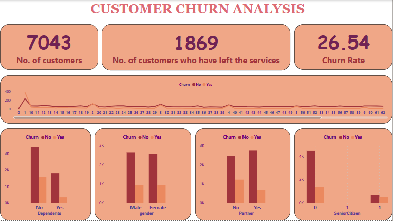
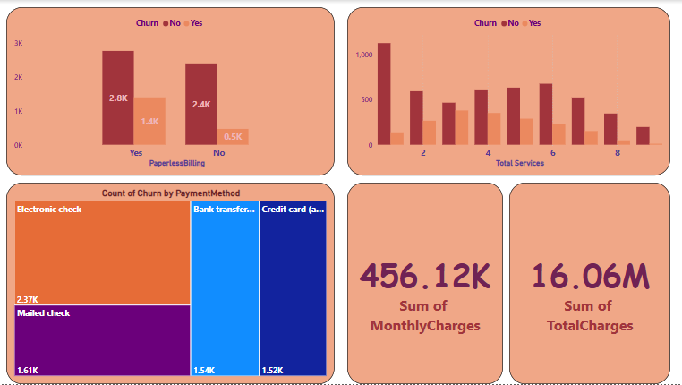
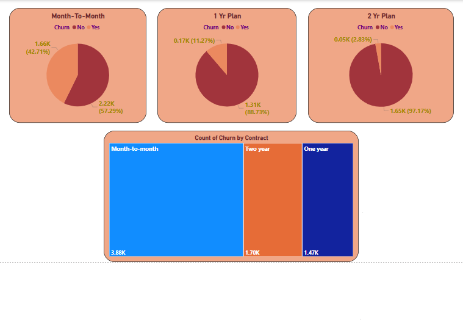

# 📊 Customer Churn Analysis (Power BI Dashboard)

Customer churn is one of the most critical business problems in service industries. This Power BI dashboard helps visualize, interpret, and understand churn patterns using real-world telecom data. It highlights key customer behaviors and contract characteristics that influence churn, giving decision-makers a data-driven foundation for retention strategies.

---

## 🧠 Business Objective

The goal of this project is to analyze why customers are leaving (churning), who is more likely to churn, and which factors — like contract type, payment method, or service usage — correlate strongly with churn. These insights are key to reducing customer loss and improving customer satisfaction.

---

## 🔍 Key Insights from the Dashboard

### 🔺 Overall
- 📈 Churn Rate: **26.5%**
- 👥 Total Customers: **7043**, Churned: **1869**

### 🧓 Demographics
- **Senior Citizens** churn more frequently than others.
- Customers **without dependents** or **partners** are more likely to churn.

### 💳 Payment & Billing
- Churn is **highest** among customers using **Electronic Checks**.
- **Paperless billing** customers have higher churn than others.

### 📦 Services & Contracts
- Customers with **Month-to-Month contracts** are significantly more likely to churn than those with 1-year or 2-year contracts.
- **More subscribed services** generally correlate with **lower churn**.

### 💰 Revenue Metrics
- Customers who churn tend to have **higher MonthlyCharges** but often **lower TotalCharges** (short tenure).

---

## 🖥️ Dashboard Walkthrough

### 📄 Page 1: Overview & Demographics
- KPIs: Customer count, Churn count, Churn rate
- Churn distribution by: Dependents, Gender, Partner, Senior Citizen

### 📄 Page 2: Billing, Services & Revenue
- Churn by: Paperless Billing, Total Services
- Tree Map: Churn by Payment Method
- KPIs: Monthly and Total Charges

### 📄 Page 3: Contracts & Tenure
- Pie charts: Churn by contract duration (Month-to-Month, 1 Year, 2 Years)
- Tree map: Count of churned customers by contract type

---

## 📁 Files Included

- `CustomerChurn.pbix` – Full Power BI dashboard file
- `churn_dataset.csv` – (Optional) Dataset used
- `/images/` – Screenshots of all dashboard pages
- `README.md` – This file

---

## 📌 Tools & Skills Used

- **Power BI**: DAX, calculated columns, slicers, KPI cards, conditional formatting
- **Data Cleaning**: Trim, replace blanks, unify binary encodings (Yes/No, 0/1)
- **Storytelling**: Designed a 3-page interactive dashboard for business decisions

---

## 📊 Dataset Details

- 📂 Source: [IBM Telco Customer Churn Dataset](https://www.kaggle.com/datasets/blastchar/telco-customer-churn)
- 7043 customer records
- Features: Customer demographics, contract details, service usage, payment method, tenure, and churn flag

---

## 📷 Dashboard Preview

### Page 1 – Overview & Demographics  
.

### Page 2 – Services, Billing & Revenue  
.

### Page 3 – Contract Type & Tenure  
.

---

## ✨ What Makes This Project Unique?

- ✅ Combines churn analysis with revenue KPIs for business-focused insights
- ✅ Layered storytelling with intuitive navigation across three focused pages
- ✅ Reusable template for telecom or any subscription-based business

---

## 📬 Contact

👨‍💻 **Created by Bakul Wani**  
📎 [LinkedIn](https://www.linkedin.com/in/bakul-wani1) • [GitHub](https://github.com/Deller23)

---

